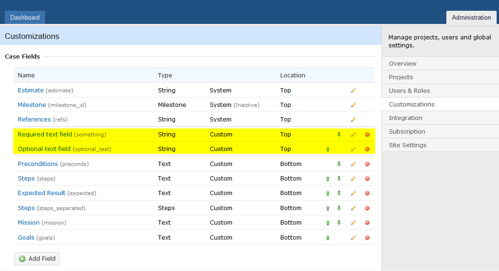
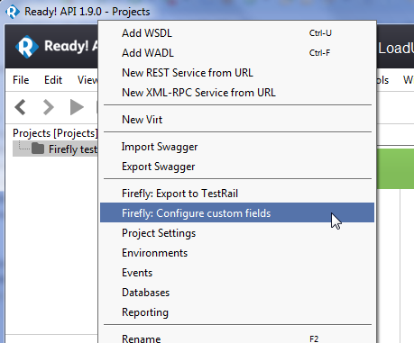
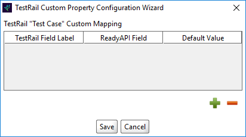
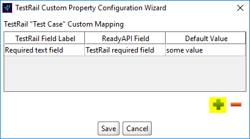
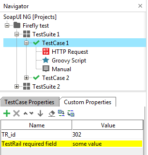
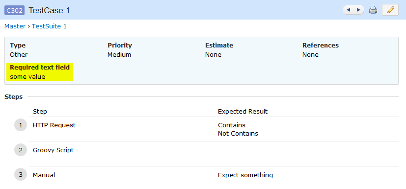

# Custom Properties Configuration
In many TestRail, users define custom user fields for test cases, like in this screenshot

 

Firefly allows users to configure custom fields easily by using a configuration wizard.
To open the wizard, simple right click on your project and select `Firefly: Configure custom fields`.

  

Simply click on Add button (green plus icon) and specify TestRail field label, SoapUI field name and default value.

Once you click on **Save** button, the default values for each of the custom properties will be added to all Test Cases of ReadyAPI project.

If you re-export project to TestRail, you will see that values from custom fields are transferred into TestRail Test Case.

