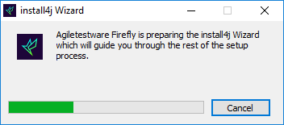
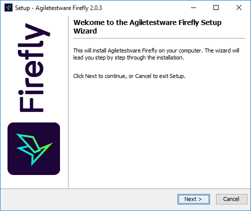
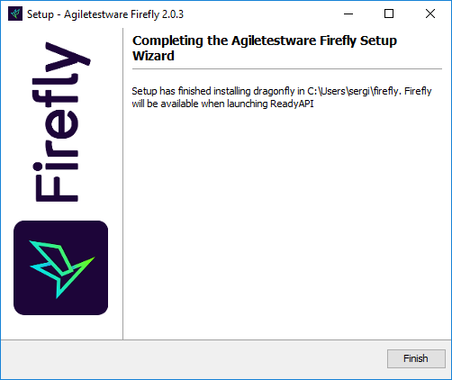

# Installation

## Installation requirements for Firefly
*	Windows OS, compatible for running ReadyAPI
*   ReadyAPI 1.7 or higher
*   TestRail version 5.3 or higher

## TestRail server configuration
TestRail API has to be enabled on TestRail server:

1.  Open TestRail web application and navigate to **Administration->Site Settings->API** 
2.  Click on **Enable API** checkbox and set it to true
3.	Click on **Save Settings** button.

## Installation of Firefly
1.	Shutdown ReadyAPI
2.	Run the Firefly installer and follow the instructions

