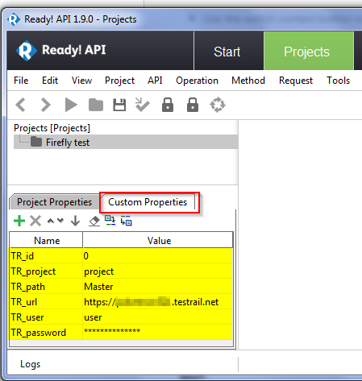
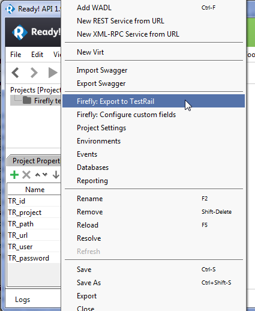
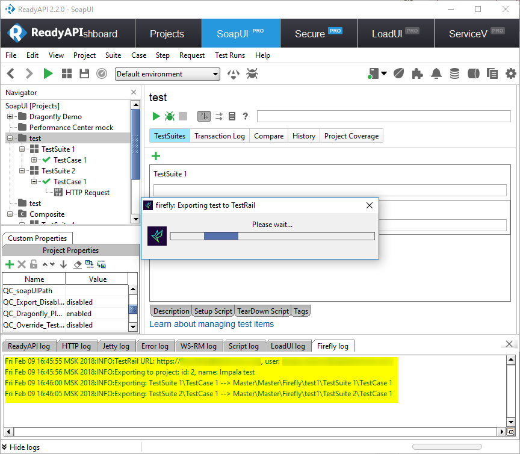
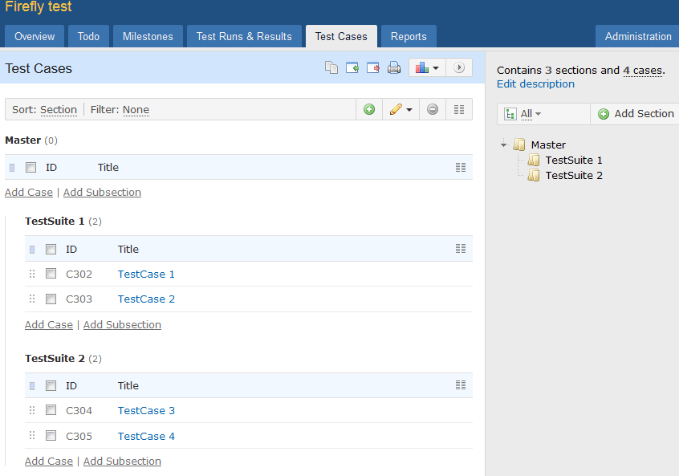
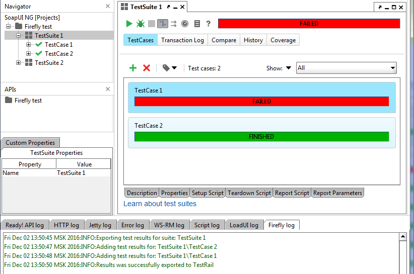
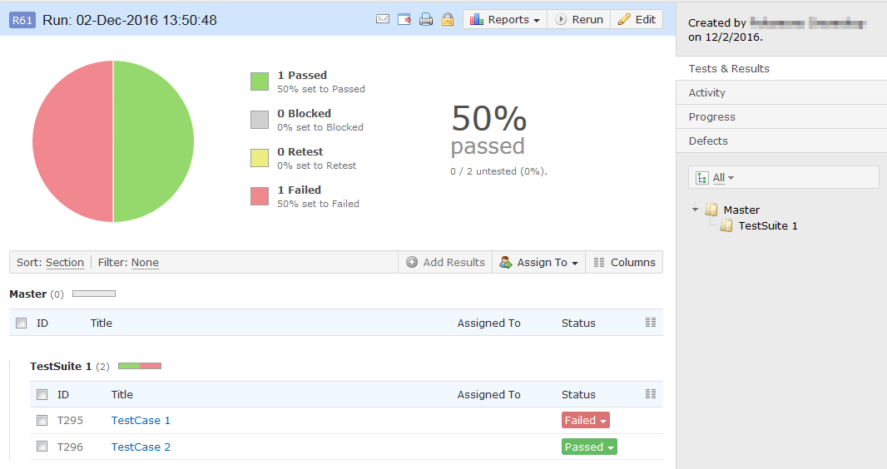
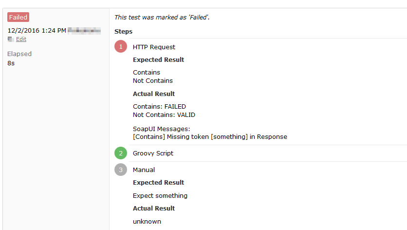

# Quick start
Follow these steps to get up and running in 10 minutes.

------------------------------------------------------------

*	Start ReadyAPI and lets configure your first project. The highlighted properties below are required and must be configured to reflect your TestRail environment settings.

*	Export ReadyAPI project into TestRail. Simply right click on **Firefly: Export to TestRail**.
Firefly plugin will show a progress bar and live export status in the Firefly log tab.

  

> Note: Export to TestRail action can also be invoked from the ReadyAPI testsuite or testcase. Project action will export/update the entire project. Whereas, testsuite or testcase level actions will only export/update the specified testsuite and testcase respectively.

*	The ReadyAPI tests should now be visible in the specified TestRail Suite\Section

*	Run tests from ReadyAPI

*	Viewing Test Results in TestRail3

